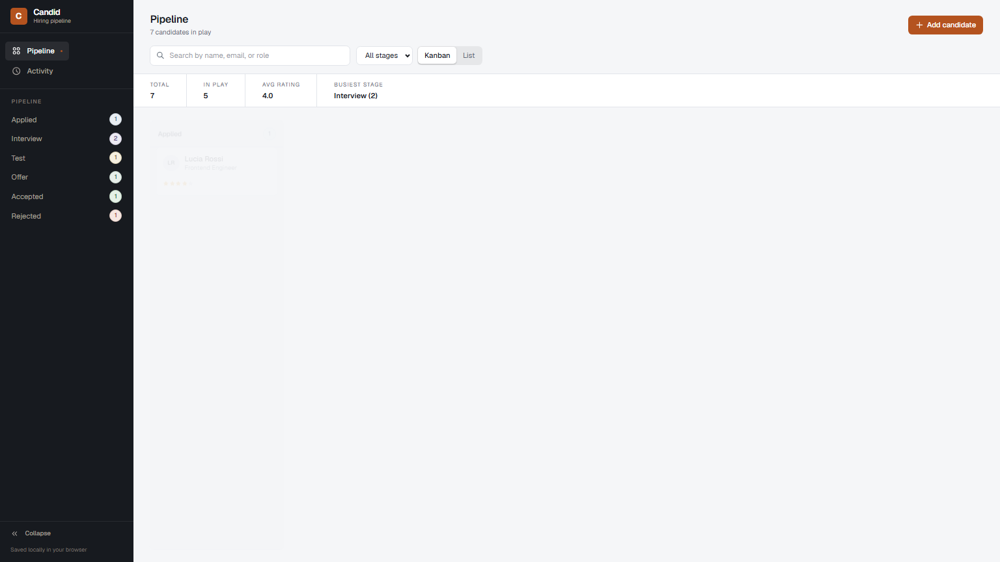

<p align="center">
  
</p>

<h1 align="center">Candid</h1>

<p align="center">
  <em>A local first hiring pipeline. Every candidate, note, and rating stays in your browser.</em>
</p>

<p align="center">
  
</p>

## Why Candid

Most applicant trackers assume you want a team workspace with ten more fields and a monthly bill. Candid assumes the opposite: one person, one tab, six stages. Drag a card, write down what you actually thought of the person, and move on.

There is no server, no database, and no account. Candidates are stored in `localStorage`, so the app works offline, loads instantly, and your data never leaves the machine. Built with Next.js, React, TypeScript, and Tailwind.

## What you get

- **One pipeline, two views.** A drag and drop board for running the funnel and a sortable table for triage. Both share the same stage colors, chips, and type scale.
- **Notes and ratings.** One to five stars plus timestamped notes signed with your name, or left anonymous.
- **Search while you type.** Filter by name, email, role, or phone, and combine it with a stage dropdown in either view.
- **An activity log.** Every move, note, and rating, newest first, capped at the last fifty entries.
- **Nothing depends on dragging.** Every card has stage arrows, every row has a dropdown, focus rings stay visible, and `Esc` and `Cmd/Ctrl + Enter` cover the repetitive bits.

## Quick start

Node 20 or newer is all you need.

```bash
npm install
npm run dev
```

Open http://localhost:3000.

Want to explore without typing your own candidates first?

```bash
npm run seed
```

The script starts the dev server if it is not running, then opens the app preloaded with a realistic pipeline. One caveat: seeding replaces whatever is stored for that origin, so run it on a board you do not mind resetting.

The first compile fetches the Geist font from Google Fonts once; later builds reuse Next's font cache.

## The pipeline

```
Applied -> Interview -> Test -> Offer -> Accepted
                              \-> Rejected
```

Stages are guidance, not locks. A card can always move back, and Accepted or Rejected candidates can be pulled into play again.

## Board, list, and details

- **Board.** A column per stage with live counts. Drag a card across, or hover to use the arrows. Narrow windows get a horizontal scroll, never a crushed column.
- **List.** Sort by name, rating, or date added by clicking the column headers. The per row stage dropdown is the fastest way to move several people at once.
- **Details.** Any card or row opens a slide out panel with the full profile, notes, rating, and edit or delete actions.
- **Activity.** A reverse chronological feed of what has happened to your pipeline.

The add form validates as you go: names and roles between 2 and 100 characters, a sane email pattern, a duplicate check so you never log the same person twice, and optional phone and LinkedIn that are checked only when provided.

## Data and privacy

Two keys hold everything, scoped to the origin you run Candid on:

| Key | Holds |
|-----|-------|
| `hiring-tracker-candidates` | The candidate array |
| `hiring-tracker-activity` | The activity log |

To start over, clear them and reload:

```js
localStorage.removeItem('hiring-tracker-candidates');
localStorage.removeItem('hiring-tracker-activity');
location.reload();
```

Because storage is per origin, localhost:3000 and any other port are separate worlds. Data moves between them by copying the two keys, not by re entering it.

## Design notes

The identity is ink and copper: cool graphite surfaces, porcelain cards, fine hairlines, and one restrained copper accent that is only used where an action matters. All colors are CSS tokens in `src/app/globals.css`, so a rebrand is editing a few variables, starting with `--color-accent`.

Stage badges are filled, tinted pills defined as plain CSS classes (`.chip-applied`, `.chip-interview`, and friends). That keeps the same palette in the sidebar, board, list, and detail panel, and guarantees the classes can never be dropped by the CSS pipeline.

Motion is deliberate and sparse: the stage change moment flashes, the modal eases in and out, and views fade between each other. Everything collapses when `prefers-reduced-motion` is set.

## Scripts

```
npm run dev          dev server with hot reload
npm run build        production build
npm start            serve the production build
npm run lint         run ESLint
npm run seed         open the app with demo data (see Quick start)
npx tsc --noEmit     typecheck
```

There is no test suite yet. `npx tsc --noEmit` and `npm run lint` are the quality gates.

## Tech stack

- Next.js (App Router) and React, with TypeScript throughout
- Tailwind CSS v4 for utilities, CSS variables for the design tokens
- Geist from `next/font` for UI type
- React Context plus a small `useLocalStorage` hook for state
- Hand rolled icons and primitives; no UI or state library

State flows one way. `AppProvider` in `src/lib/AppContext.tsx` owns the candidates and the activity log, writes both to `localStorage`, and hands views a small set of actions (`addCandidate`, `moveCandidate`, `addNote`, and the rest). Views derive search, filter, and sort at render time, so there is no second copy of data to drift out of sync.

## Structure

```
src/
  app/          layout, entry page, globals.css tokens, icon.svg favicon
  components/   Dashboard shell, board, list, detail, modal, empty state,
                sidebar, stats, toast, and shared UI primitives
  lib/          AppContext (state), types, validation, filter helpers,
                demo data used by npm run seed
scripts/
  seed.mjs      starts the server and opens the seeded app
docs/
  logo.svg      wordmark used in this README
  candid-board.png
```

## License

MIT
